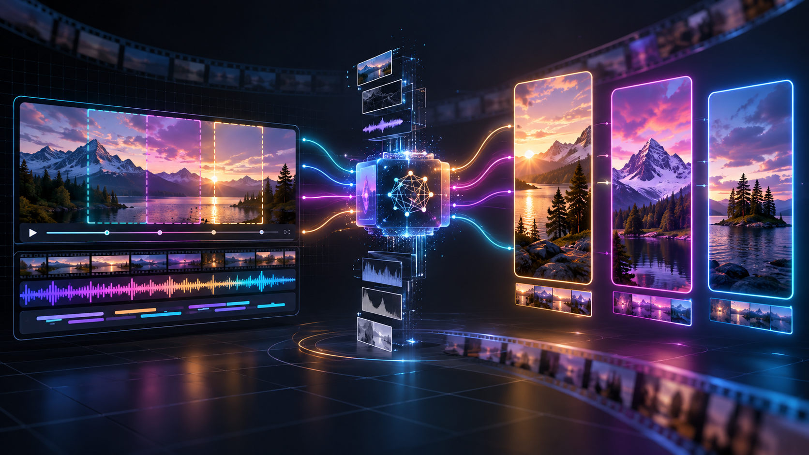
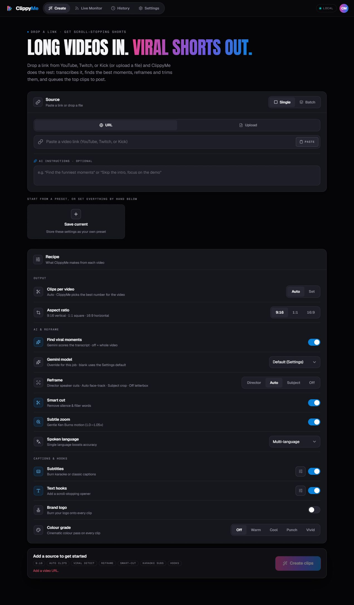

<a id="readme-top"></a>

<div align="center">
  
  <h1>ClippyMe</h1>
  <p><strong>Локальная AI-платформа, которая превращает длинные видео в готовые вертикальные клипы.</strong></p>
  <p>
    
    
    
    
    
  </p>
  <p>
    <a href="#быстрый-запуск">Быстрый запуск</a> ·
    <a href="#какие-api-нужны">API-ключи</a> ·
    <a href="#как-пользоваться">Как пользоваться</a> ·
    <a href="#rest-api">REST API</a> ·
    <a href="#решение-проблем">Решение проблем</a>
  </p>
</div>



> Иллюстрация для проекта создана через OpenAI ImageGen. Ниже приведён настоящий скриншот локально запущенного интерфейса.

ClippyMe принимает ссылку YouTube, Twitch или Kick либо локальный видеофайл, извлекает речь, находит наиболее сильные фрагменты, аккуратно обрезает их, переводит кадр в нужное соотношение сторон, добавляет субтитры, хук, цветокоррекцию и логотип. Готовые клипы можно скачать, отредактировать, опубликовать сразу или поставить в расписание.

Проект работает локально и рассчитан прежде всего на self-hosted-установку. Исходные видео, настройки и API-ключи не требуется передавать стороннему владельцу сервиса; облачным провайдерам отправляются только данные, необходимые выбранной функции.

## Содержание

- [Что умеет ClippyMe](#что-умеет-clippyme)
- [Как устроена обработка](#как-устроена-обработка)
- [Системные требования](#системные-требования)
- [Быстрый запуск](#быстрый-запуск)
- [Какие API нужны](#какие-api-нужны)
- [Как пользоваться](#как-пользоваться)
- [Режимы кадрирования](#режимы-кадрирования)
- [Редактор клипа](#редактор-клипа)
- [Live Monitor](#live-monitor)
- [Публикация через Zernio](#публикация-через-zernio)
- [Хранение данных](#хранение-данных)
- [Настройка через переменные окружения](#настройка-через-переменные-окружения)
- [Запуск без Docker](#запуск-без-docker)
- [REST API](#rest-api)
- [Безопасность](#безопасность)
- [Тестирование](#тестирование)
- [Решение проблем](#решение-проблем)
- [Структура репозитория](#структура-репозитория)

## Что умеет ClippyMe

- Принимает одну ссылку, пакет до 20 ссылок или загруженные видеофайлы.
- Загружает видео через `yt-dlp`; для возрастных и региональных ограничений поддерживает `cookies.txt` и профиль Firefox.
- Расшифровывает речь через Deepgram Nova-3, ElevenLabs Scribe или локальный Faster-Whisper.
- Определяет вирусные моменты через Gemini и оценивает силу начала, эмоциональную отдачу, цитируемость, самостоятельность и плотность фрагмента.
- Работает без Gemini: TextTiling делит расшифровку на тематические фрагменты локально.
- Уточняет границы клипа по словам, предложениям и ближайшим участкам тишины.
- Создаёт видео `9:16`, `1:1` или `16:9`.
- Поддерживает четыре режима камеры: Director, Auto, Subject и Off/letterbox.
- Удаляет паузы и слова-паразиты с помощью Smart Cut.
- Добавляет караоке- или классические субтитры, текстовый хук, логотип, баннер автора и цветовой пресет.
- Позволяет вручную исключать реплики из транскрипта или описать правку обычным текстом.
- Ставит задания в очередь, умеет ставить их на паузу, продолжать, остановить с сохранением результата или отменить с удалением.
- Сохраняет контрольные точки и возобновляет работу после временной ошибки или перезапуска backend.
- Проверяет результат через `ffprobe`: аудио/видео, длительность, геометрию, чёрные и зависшие кадры, громкость.
- Публикует и планирует клипы для TikTok, Instagram и YouTube через Zernio.
- Следит за каналами YouTube, Twitch и Kick в режиме Live Monitor.

## Как устроена обработка

```text
Ссылка или файл
      │
      ▼
Загрузка / проверка входного видео
      │
      ▼
Извлечение mono 16 kHz FLAC → транскрипция
      │
      ▼
Gemini-анализ или локальный TextTiling
      │
      ▼
Уточнение границ по словам, предложениям и тишине
      │
      ▼
Кадрирование Director / Auto / Subject / Letterbox
      │
      ▼
Нормализация звука, zoom, обложка и контроль качества
      │
      ▼
Редактирование → скачивание или публикация
```

Очередь выполняет устойчивый оркестратор. Он проводит preflight-проверку, атомарно сохраняет состояние задания, повторяет только временные сбои и использует уже готовые загрузку, транскрипт и клипы при повторном старте.

## Системные требования

Рекомендуемый способ — Docker Compose.

- Windows 10/11, macOS или Linux.
- [Docker Desktop](https://docs.docker.com/desktop/) с Docker Compose 2.24 или новее.
- Git.
- Не менее 8 ГБ RAM; 16 ГБ удобнее для локального Whisper.
- Достаточно места для исходника, промежуточных файлов и готовых клипов.
- NVIDIA GPU необязательна. CPU-режим работает на x86_64, ARM64 и Apple Silicon.

На Windows включите WSL 2 при установке Docker Desktop. Для GPU-режима нужны совместимые драйверы NVIDIA.

## Быстрый запуск

### Уже есть локальная копия `M:\clippyme`

```powershell
Set-Location M:\clippyme
git fetch origin
git switch codex/staged-hardening
git pull --ff-only
docker compose up --build
```

### Чистая установка из GitHub

```powershell
git clone https://github.com/asmikheye/Start-Balanced-power.git clippyme
Set-Location .\clippyme
git switch codex/staged-hardening
docker compose up --build
```

После запуска откройте:

- интерфейс: <http://localhost:5175>;
- backend: <http://localhost:8000>;
- health-check: <http://localhost:8000/api/health>.

Первый запуск дольше следующих: Docker собирает образ и загружает зависимости/модели. Остановить приложение можно клавишами `Ctrl+C`, а затем командой:

```powershell
docker compose down
```

Данные сохраняются в `data/`, поэтому обычный `docker compose down` их не удаляет.

### NVIDIA GPU

```powershell
docker compose -f docker-compose.yml -f docker-compose.gpu.yml up --build
```

### Production-frontend через nginx

```powershell
docker compose -f docker-compose.yml -f docker-compose.prod.yml up --build
```

В этом варианте React собирается заранее и отдаётся через nginx. Backend и порты остаются прежними.

## Какие API нужны

Для первого запуска обязательных платных API нет:

- выберите `Whisper`, чтобы транскрипция выполнялась локально;
- без Gemini программа применит локальное тематическое разбиение TextTiling;
- без Zernio готовые файлы можно скачивать вручную.

Облачные ключи дают более быстрый или более функциональный режим.

| Доступ | Для чего | Обязателен | Где получить |
|---|---|---:|---|
| `GEMINI_API_KEY` | Поиск сильных моментов, AI Trim, названия и описания | Нет, есть TextTiling | [Google AI Studio](https://aistudio.google.com/apikey) · [документация](https://ai.google.dev/gemini-api/docs/api-key) |
| `DEEPGRAM_API_KEY` | Быстрая транскрипция Nova-3 и diarization | Нет | [Deepgram Console](https://console.deepgram.com/) · [создание ключа](https://developers.deepgram.com/docs/create-additional-api-keys) |
| `ELEVENLABS_API_KEY` | Scribe, отметки смеха/аплодисментов, удаление шума | Нет | [ElevenLabs API Keys](https://elevenlabs.io/app/settings/api-keys) · [документация](https://elevenlabs.io/docs/overview/administration/workspaces/api-keys) |
| `HF_TOKEN` | Gated-модели Hugging Face и diarization Whisper | Только для соответствующего режима | [Hugging Face Tokens](https://huggingface.co/settings/tokens) · [документация](https://huggingface.co/docs/hub/security-tokens) |
| Twitch Client ID/Secret | Отслеживание Twitch в Live Monitor | Только для Twitch Monitor | [Twitch Developer Console](https://dev.twitch.tv/console/apps) · [регистрация приложения](https://dev.twitch.tv/docs/authentication/register-app) |
| Zernio API key | Публикация/расписание TikTok, Instagram и YouTube | Только для публикации | [Zernio](https://zernio.com/) · [Quickstart API](https://docs.zernio.com/) |
| YouTube cookies | Возрастные, региональные или bot-protected ролики | Иногда | Экспорт Netscape `cookies.txt` либо read-only-профиль Firefox |

### Куда вводить ключи

1. Запустите ClippyMe.
2. Откройте `Settings`.
3. Заполните нужные поля в блоках `API keys` и `Publishing`.
4. Нажмите `Save`.

Ключи сохраняются локально в `data/config.json`. Файл исключён из Git и создаётся с ограниченными правами доступа. Не вставляйте реальные ключи в README, `.env.example`, issue, commit или скриншот.

Альтернативный способ — создать `.env` из примера:

```powershell
Copy-Item .env.example .env
notepad .env
docker compose up --build
```

Минимальный облачный набор: `GEMINI_API_KEY` + один провайдер транскрипции (`DEEPGRAM_API_KEY` или `ELEVENLABS_API_KEY`). Если облачная транскрипция не сработает, pipeline автоматически попробует Faster-Whisper.

### Особенности ключей

**Gemini.** Создайте ключ в Google AI Studio и добавьте его в `Settings → Gemini`. Модель можно сменить глобально или только для одного задания. Для квотных ошибок предусмотрена цепочка fallback-моделей.

**Deepgram.** Создайте Project API Key. В ClippyMe используется Nova-3; `multi` подходит для смешанной речи, а конкретный язык обычно повышает точность.

**ElevenLabs.** Создайте ключ с доступом к Speech-to-Text. Scribe способен возвращать audio events — например, смех и аплодисменты. Voice Isolator включается отдельно и может расходовать дополнительную квоту.

**Hugging Face.** Для скачивания моделей достаточно read-токена. Для pyannote примите условия [speaker-diarization-3.1](https://huggingface.co/pyannote/speaker-diarization-3.1), соберите образ с `ENABLE_WHISPER_DIARIZE=1` и передайте `HF_TOKEN`:

```powershell
$env:ENABLE_WHISPER_DIARIZE = "1"
$env:HF_TOKEN = "hf_..."
docker compose build --no-cache backend
docker compose up
```

**Twitch.** Зарегистрируйте приложение, включив 2FA в аккаунте Twitch. Скопируйте Client ID и создайте Client Secret. Они нужны только серверному Live Monitor.

**Zernio.** Создайте ключ, подключите социальные аккаунты, затем в `Settings → Publishing` вставьте ключ и нажмите `Discover from Zernio`.

## Как пользоваться



### 1. Добавьте источник

На вкладке `Create` выберите:

- `Single` — одна ссылка или один файл;
- `Batch` — несколько URL или файлов;
- `URL` — YouTube, Twitch или Kick;
- `Upload` — локальный видеофайл.

Поле AI instructions необязательно. Примеры: «найди самые смешные моменты», «пропусти вступление», «сосредоточься на демонстрации продукта».

### 2. Настройте Recipe

- `Clips per video`: автоматическое количество или фиксированный лимит.
- `Aspect ratio`: `9:16`, `1:1` или `16:9`.
- `Find viral moments`: Gemini-анализ; при отключении обрабатывается всё видео.
- `Gemini model`: модель только для текущего задания.
- `Reframe`: Director, Auto, Subject или Off.
- `Smart cut`: удаление тишины и слов-паразитов.
- `Subtle zoom`: мягкий Ken Burns zoom `1.0 → 1.05`.
- `Spoken language`: точный язык либо мультиязычный режим.
- `Subtitles`: караоке или классические подписи.
- `Text hooks`: короткий текст в начале клипа.
- `Brand logo`: наложение загруженного PNG.
- `Colour grade`: Warm, Cool, Punch или Vivid.

Текущую комбинацию можно сохранить как собственный preset.

### 3. Следите за обработкой

- `Pause` — приостановить процесс;
- `Resume` — продолжить;
- `Stop & keep` — остановить, но оставить готовые клипы;
- `Discard/Cancel` — отменить и удалить результаты.

Готовые клипы появляются по мере рендера — ждать окончания всего задания необязательно.

### 4. Проверьте результат

На карточке клипа доступны просмотр, редактирование, скачивание, отключение/удаление и публикация. В `History` можно открыть прошлое задание, восстановить его состояние или удалить вместе с файлами.

## Режимы кадрирования

| Режим | Что делает | Когда выбирать |
|---|---|---|
| `Director` | Использует diarization и делает переключения виртуальной камеры между говорящими | Интервью, подкасты, диалоги |
| `Auto` | Ищет лица/людей, оценивает активного говорящего и выбирает сценовую стратегию | Универсальный режим с людьми |
| `Subject` | FrameShift-кадрирование по лицу, человеку и весам объектов | Демонстрации, товары, животные, главный объект |
| `Off` | Не обрезает кадр; помещает его целиком между чёрными полями | Когда нельзя терять края экрана |

Comfort mode включён по умолчанию: внутри сцены камера стремится оставаться неподвижной. Для каждой сцены фиксируется безопасный crop и zoom; при большой активности выбирается более широкий кадр.

## Редактор клипа

Изменения применяются в порядке:

```text
Цветокоррекция → Субтитры → Smart Cut/Trim → Хук → Логотип → Баннер
```

- **Reframe:** повторное переключение режима по сохранённому `source_*.mp4`.
- **Captions:** караоке ASS или классические субтитры; шрифт, размер, цвет, контур, фон и позиция. Свои `.ttf`/`.otf` загружаются в Settings.
- **Hook:** короткий заголовок, обычно на первые четыре секунды; настраиваются шрифт, цвет, фон и обводка.
- **Smart Cut:** автоматическое удаление тишины и слов-паразитов.
- **Trim:** ручное исключение строк транскрипта.
- **AI Trim:** преобразование обычной текстовой инструкции в диапазоны удаления через Gemini.
- **Logo:** прозрачный PNG поверх клипа.
- **Banner:** платформа и имя автора; в letterbox-режиме размещается в свободной полосе.
- **Grade:** Warm, Cool, Punch или Vivid до наложения текста.

Изменения можно применить к одному клипу, ко всем или к выбранной группе. Композиция выполняется при применении правок, скачивании или перед публикацией.

## Live Monitor

Live Monitor автоматически проверяет каналы и создаёт клипы из новых материалов:

- Twitch live и VOD;
- Kick live и VOD;
- YouTube — новые длинные ролики из RSS; Shorts исключаются.

Для monitor задаются канал, режим, частота проверки, максимальное количество клипов, фиксированный или автоматический отбор, минимальная viral score, Smart Cut, letterbox zoom, публикация и расписание.

Несколько каналов могут работать одновременно. Очередь публикации общая, поэтому SmartScheduler не ставит посты слишком близко. Публикацию можно поставить на паузу; ожидающие клипы сохраняются и отправляются после продолжения или перезапуска.

## Публикация через Zernio

ClippyMe отправляет клипы в TikTok, Instagram и YouTube через Zernio:

- `Publish now` — сразу;
- ручная дата и время;
- `Prime Time` — автоматические слоты;
- один или несколько клипов;
- отдельные тексты/названия для платформ;
- повторная композиция перед загрузкой, чтобы файл совпадал с preview.

По умолчанию новые расписания используют `Europe/Istanbul`. Ответы Zernio, включая дневной лимит платформы, показываются без скрытия исходного сообщения.

## Хранение данных

| Путь | Содержимое |
|---|---|
| `data/config.json` | API-ключи и настройки |
| `data/cookies.txt` | YouTube cookies |
| `data/live_monitor.json` | Состояние Live Monitor |
| `data/jobs_journal.json` | Активные задания без секретов |
| `data/cache/` | Кэш транскриптов |
| каталоги заданий | Клипы, исходные фрагменты и метаданные |

Конфигурация и runtime-артефакты исключены из Git. Удаление задания из `History` удаляет связанные файлы backend; закрытие браузера этого не делает.

## Настройка через переменные окружения

Полный список находится в [`.env.example`](.env.example). Основные параметры:

| Переменная | По умолчанию | Назначение |
|---|---|---|
| `GEMINI_API_KEY` | пусто | Gemini API |
| `GEMINI_MODEL` | `gemini-3.6-flash` | Основная модель анализа |
| `TRANSCRIPTION_PROVIDER` | `deepgram` | `deepgram`, `elevenlabs` или `whisper` |
| `DEEPGRAM_API_KEY` | пусто | Deepgram Nova-3 |
| `ELEVENLABS_API_KEY` | пусто | ElevenLabs Scribe |
| `HF_TOKEN` | пусто | Hugging Face модели |
| `CLIPPYME_BIND` | `127.0.0.1` | Адрес публикации портов Docker |
| `CLIPPYME_API_TOKEN` | пусто | Защита `/api` при доступе по LAN |
| `MAX_CONCURRENT_JOBS` | `5` | Одновременные задания |
| `MAX_FILE_SIZE_MB` | `16384` | Максимальный upload, МБ |
| `GPU_RUNTIME` | `cpu` | `cpu` или `nvidia` |
| `CLIPPYME_X264_CRF` | `18` | Качество H.264; меньше — лучше и больше файл |
| `CLIPPYME_X264_PRESET` | `medium` | Скорость/эффективность x264 |
| `CLIPPYME_JOB_MAX_ATTEMPTS` | `3` | Попытки временно упавшего задания |
| `CLIPPYME_MAX_CLIPS` | пусто | Глобальный лимит клипов |
| `CLIPPYME_MIN_FREE_DISK_GB` | `1` | Запас свободного места |
| `REFRAME_COMFORT` | `1` | Стабильная камера |
| `REFRAME_STATIC_AUTO` | включено | Фиксированный crop на сцену |
| `ZERNIO_DEFAULT_TZ` | `Europe/Istanbul` | Часовой пояс публикаций |

После изменения build-параметров пересоберите контейнер:

```powershell
docker compose down
docker compose up --build
```

## Запуск без Docker

Нужны Python 3.11, Node.js, npm, `ffmpeg`, `ffprobe`, системные библиотеки OpenCV/MediaPipe и остальные зависимости.

Backend:

```powershell
python -m venv .venv
.\.venv\Scripts\Activate.ps1
python -m pip install --upgrade pip
pip install -r requirements.txt
pip install -e .
python -m uvicorn clippyme.api.app:app --reload --port 8000
```

Frontend в отдельном терминале:

```powershell
Set-Location M:\clippyme\dashboard
npm ci
npm run dev
```

CLI без web-интерфейса:

```powershell
python -m clippyme.pipeline.main "https://example.com/video" `
  --instructions "Найди самые сильные моменты" `
  --reframe-mode auto
```

Для обычной установки Docker надёжнее: образ уже содержит ffmpeg, ML/CV-зависимости и auto-editor.

## REST API

Если задан `CLIPPYME_API_TOKEN`, добавляйте `X-API-Token` или `Authorization: Bearer`.

| Метод | Путь | Назначение |
|---|---|---|
| `GET` | `/api/health` | Проверка backend |
| `POST` | `/api/process` | Одно видео |
| `POST` | `/api/batch` | Пакет до 20 источников |
| `GET` | `/api/status/{job_id}` | Статус и прогресс |
| `POST` | `/api/pause/{job_id}` | Пауза |
| `POST` | `/api/resume/{job_id}` | Продолжить |
| `POST` | `/api/stop/{job_id}` | Остановить и сохранить готовое |
| `POST` | `/api/cancel/{job_id}` | Отменить и удалить |
| `POST` | `/api/compose/{job_id}/{clip_index}` | Собрать слои редактора |
| `POST` | `/api/smartcut/{job_id}/{clip_index}` | Smart Cut / ручные диапазоны |
| `GET` | `/api/transcript/{job_id}/{clip_index}` | Транскрипт клипа |
| `POST` | `/api/edit-ai/{job_id}/{clip_index}` | AI Trim |
| `POST` | `/api/reframe/{job_id}/{clip_index}` | Повторное кадрирование |
| `POST` | `/api/publish/{job_id}/{clip_index}` | Публикация через Zernio |
| `GET` | `/api/history` | История заданий |
| `POST` | `/api/history/{job_id}/restore` | Восстановить задание |
| `DELETE` | `/api/history/{job_id}` | Удалить задание и файлы |
| `POST` | `/api/live-monitor/start` | Запустить monitor |
| `POST` | `/api/live-monitor/stop` | Остановить monitor |
| `GET` | `/api/live-monitor/status` | Статус monitor-ов |
| `GET/POST` | `/api/config` | Локальная конфигурация |
| `GET/POST/DELETE` | `/api/config/cookies*` | YouTube cookies |
| `GET/POST/DELETE` | `/api/config/fonts*` | Пользовательские шрифты |
| `GET/POST/DELETE` | `/api/config/logo*` | Логотип бренда |
| `GET/POST` | `/api/config/zernio` | Настройки Zernio |

```powershell
Invoke-RestMethod http://localhost:8000/api/health
```

## Безопасность

- По умолчанию оба порта публикуются только на `127.0.0.1`.
- Не выставляйте приложение напрямую в интернет.
- Для LAN используйте `CLIPPYME_BIND=0.0.0.0` только в доверенной сети и задайте длинный случайный `CLIPPYME_API_TOKEN`.
- Для интернета нужен reverse proxy с HTTPS и контролем доступа. `TRUST_PROXY=1` допустим только при одном доверенном proxy-hop.
- Не коммитьте `.env`, `data/config.json`, `cookies.txt`, логи с ключами или приватные видео.
- Включите Git-hook сканирования секретов:

```powershell
git config core.hooksPath .githooks
```

## Тестирование

Backend:

```powershell
pip install -e ".[host-tests]"
pip install pytest ruff
pytest -m "not integration" -q
ruff check src/clippyme tests --select E9,F63,F7,F82
```

Frontend:

```powershell
Set-Location dashboard
npm ci
npm test
npm run lint
npm run build
```

CV/ML integration:

```powershell
docker compose run --rm -u root backend sh -lc "pip install -q pytest && pytest -m integration"
```

## Решение проблем

### Порты 5175 или 8000 заняты

```powershell
Get-NetTCPConnection -State Listen -LocalPort 5175,8000
docker compose down
```

Остановите конфликтующий процесс либо измените опубликованные порты в локальном compose override.

### После `git pull` frontend ведёт себя странно

Если изменились зависимости:

```powershell
docker compose down -v
docker compose up --build
```

`-v` удалит анонимный volume `node_modules`, но не bind-mounted `data/`. Всё равно проверьте Docker volumes перед командой.

### YouTube выдаёт 403 или проверку бота

1. Откройте `Settings → Downloads`.
2. Загрузите Netscape `cookies.txt` из собственного браузера.
3. Либо скопируйте `docker-compose.override.example.yml` в `docker-compose.override.yml` и задайте `CLIPPYME_FIREFOX_PROFILE_HOST_PATH` на профиль с `cookies.sqlite`.

Не публикуйте cookies и не добавляйте профиль браузера в репозиторий.

### Gemini сообщает quota/rate limit

- выберите более доступную модель;
- проверьте квоту/биллинг в Google AI Studio;
- оставьте `GEMINI_FALLBACK_MODELS`;
- временно отключите `Find viral moments`.

### Deepgram или ElevenLabs не работает

Проверьте ключ, квоту и выбранный `Transcription engine`. При сбое ClippyMe переходит на Faster-Whisper, поэтому первая локальная модель может скачиваться долго.

### Не хватает памяти или места

- выберите Whisper `base`/`small`;
- уменьшите `MAX_CONCURRENT_JOBS`;
- используйте облачную транскрипцию;
- включите NVIDIA-профиль;
- удалите ненужные задания через `History`;
- оставьте запас через `CLIPPYME_MIN_FREE_DISK_GB`.

### Zernio не видит аккаунты

Проверьте ключ и подключённые аккаунты, затем снова нажмите `Discover from Zernio`. При проблеме TLS можно задать:

```env
ZERNIO_BASE_URL=https://api.zernio.com/api/v1
```

## Структура репозитория

```text
clippyme/
├── src/clippyme/
│   ├── api/            # FastAPI и HTTP-маршруты
│   ├── domain/         # задания, редактор, история, публикация, monitor
│   ├── integrations/   # Zernio, Twitch, Kick, YouTube
│   ├── pipeline/       # загрузка, транскрипция, Gemini, reframe, QA
│   └── storage/        # локальная конфигурация
├── dashboard/          # React/Vite-интерфейс
├── docs/               # архитектура и исследовательские материалы
├── tests/              # backend-тесты
├── data/               # локальные данные, не для Git
├── docker-compose.yml
├── docker-compose.gpu.yml
└── .env.example
```

Дополнительные материалы:

- [`docs/runtime-quality.md`](docs/runtime-quality.md) — повторы, preflight, checkpoint и QA;
- [`docs/architecture-history.md`](docs/architecture-history.md) — история архитектуры;
- [`docs/reframe-improvements-research.md`](docs/reframe-improvements-research.md) — стабилизация камеры;
- [`docs/title-hook-copy-research.md`](docs/title-hook-copy-research.md) — названия и hooks;
- [`TESTING.md`](TESTING.md) — расширенная инструкция по тестам.

## Лицензия и происхождение

ClippyMe — self-hosted fork OpenShorts с расширенным pipeline, устойчивой очередью, несколькими провайдерами транскрипции, редактором, Live Monitor и публикацией через Zernio. Условия использования находятся в [`LICENSE`](LICENSE).

<p align="right"><a href="#readme-top">Наверх ↑</a></p>
